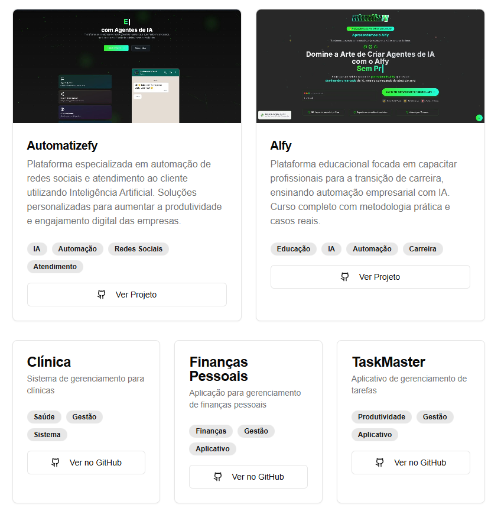

# Portfolio - Tiago Cruz



## 🚀 Sobre o Projeto

Portfolio profissional desenvolvido com tecnologias modernas, destacando minha experiência como Desenvolvedor Full Stack e Especialista em Automação e IA. O site apresenta uma interface moderna e responsiva, com animações sutis e organização clara do conteúdo.

### ✨ Características

- Design moderno e responsivo
- Animações suaves e interativas
- Seções bem organizadas para projetos e habilidades
- Background animado representando IA e automação
- Interface otimizada para todos os dispositivos

### 🛠️ Tecnologias Utilizadas

- **Next.js** - Framework React para produção
- **Tailwind CSS** - Framework CSS utilitário
- **Shadcn/UI** - Componentes reutilizáveis
- **TypeScript** - Tipagem estática
- **Lucide Icons** - Ícones modernos e escaláveis

## 🚦 Como Executar

```bash
# Clone o repositório
git clone https://github.com/tiagotauruzdev/tiagocruz.git

# Entre no diretório
cd tiagocruz

# Instale as dependências
npm install

# Execute o servidor de desenvolvimento
npm run dev
```

O site estará disponível em `http://localhost:3000`

## 📱 Contato

- Email: tiagocruz.lp@gmail.com
- LinkedIn: [Tiago Cruz](https://www.linkedin.com/in/tiago-cruz-aa8128b7/)
- Instagram: [@tiagocruz.ia](https://instagram.com/tiagocruz.ia)
- Telefone: (14) 99768-3073

## 📄 Licença

Este projeto está sob a licença MIT. Veja o arquivo [LICENSE](LICENSE) para mais detalhes.
